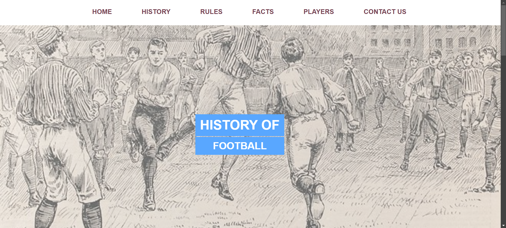
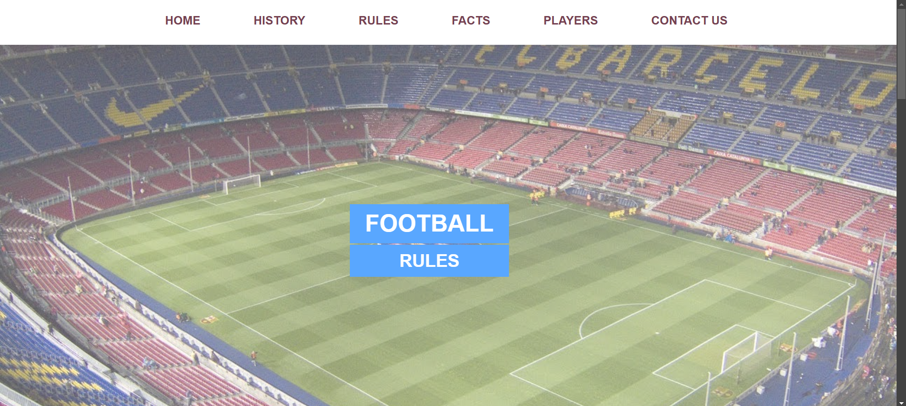
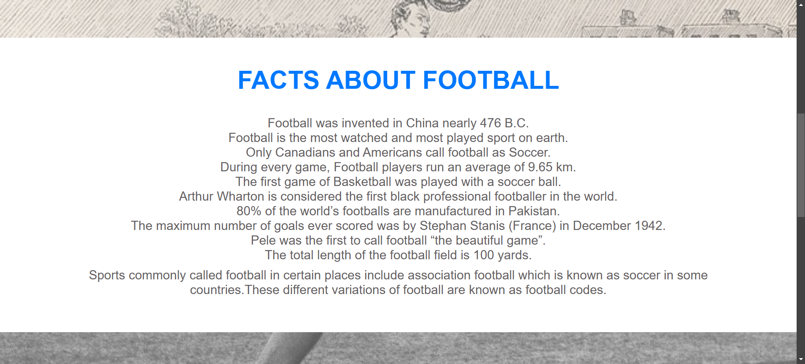
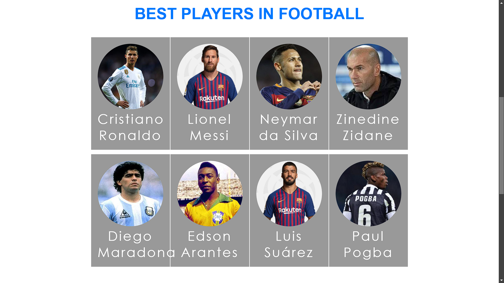
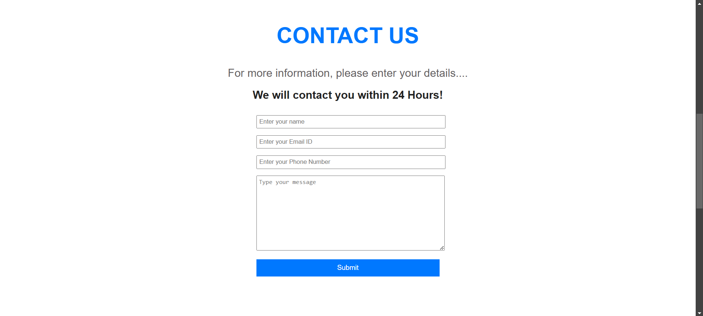

# Football Website with Parallax Scrolling

This repository features a multi-page football-themed website built using only HTML and CSS. Each page integrates a parallax scrolling effect, providing a dynamic sense of depth and visual interest as you navigate the content.

## Features
- **Multiple Pages:** Explore different sections such as **History**, **Rules**, **Facts**, and **Players**.  
- **Parallax Scrolling:** Layered background images move at varying speeds, creating a subtle 3D effect and enhancing the overall user experience.  
- **Pure HTML & CSS:** Crafted without external frameworks, making it an excellent resource for beginners to understand fundamental web development concepts.  

## Demo
Below are some screenshots showcasing the website’s layout and parallax effects.

**Homepage:**

**History Page:**

**Rules Page:**

**Facts Page:**

**Players Page:**

**Players Page:**

*(Note: No backend for the form.)*

